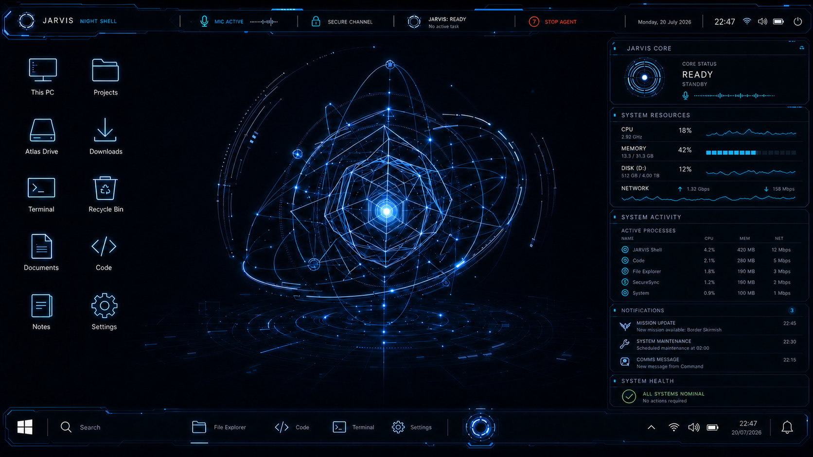

# JarvisV1

JarvisV1 is an experimental HUD-style desktop shell for Windows 10 and Windows 11. It combines a native C#/WPF host with a React/WebView2 interface to provide a replacement taskbar, desktop command surface, system telemetry, native window styling, file tools, and an integrated ConPTY terminal.



## Current scope

- Windows 10 and Windows 11 Home/Pro desktop environments
- Hybrid primary-taskbar composition by default, preserving Explorer's notification area, with optional native fallback and experimental full replacement, fullscreen-aware reversible suppression, running-window synchronization, delayed DWM hover previews, session-scoped Show Desktop restore, and a recovery watchdog
- Current-virtual-desktop window scoping for the replacement taskbar and bounded HUD Alt+Tab switcher, with fail-open public-API fallback and native Windows fallback in hybrid, safe, secure-desktop, and renderer-failure paths
- Local Quick Search from the desktop and replacement taskbar, with keyboard scope switching and bounded history
- A centered Pi Agent taskbar entry and embedded streaming chat window; V1 keeps Pi tools disabled and lazily starts a repository-pinned, privately bundled runtime only when a prompt is sent
- Explorer-owned notification area in hybrid mode, with automatic native fallback
- Real Windows audio, network, power, and local-time state shared by the top bar, taskbar, Quick Settings, and the taskbar date-and-time center
- Keyboard-accessible Monday-first calendar with session-event filtering and an allowlisted handoff to Windows Date & Time Settings
- Guarded Session Control center for Exit to Windows, lock, sign out, restart, and shutdown, with single-use confirmation capabilities and no renderer-supplied commands
- Session-only JARVIS System Feed with bounded, deduplicated host events
- Keyboard-first application search and launcher
- Cancellable File Explorer copy/move jobs with conflict policies, byte progress, long-path support, and verified cross-volume moves
- Live desktop-folder synchronization, Windows-style multi-selection, native clipboard file operations, and recycle-safe desktop commands
- Drag-and-drop between the JARVIS desktop and File Explorer, plus validated file drops from Windows onto either surface
- Primary-monitor desktop ownership with per-monitor DPI telemetry while secondary Windows taskbars remain available
- Truthful Windows notification-history readiness reporting; history remains disabled until a signed MSIX identity and user consent are available
- Windows-native system telemetry and on-demand process/hardware inspection
- Integrated PowerShell, Command Prompt, and WSL sessions through ConPTY
- Configurable conservative, enhanced, and experimental immersive window styling
- Layered low-glare HUD themes and optional local interaction sounds
- Per-user installer and startup registration

JarvisV1 is under active development. The experimental immersive mode can alter the appearance of eligible application windows, but it does not replace the Windows sign-in or secure desktop. `Ctrl+Shift+Q` is the global recovery shortcut for returning to the native Windows shell.

## Architecture

- `frontend/` — React and Vite interface rendered by WebView2
- `host/` — .NET 8 WPF host, Windows bridge, taskbar and recovery services
- `installer/` — Inno Setup definition for per-user installation
- `scripts/` — release and native lifecycle verification scripts
- `third_party/pi/` — pinned Pi release trust manifest and retained MIT license; upstream binaries remain build artifacts, not source-control payloads
- `assets/archive/` — approved source visual assets retained for restoration

The WebView renderer receives bounded capabilities rather than executable paths or arbitrary command lines. Windows integration and safety-sensitive operations remain in the native host.

## Development

Requirements:

- x64-compatible Windows 10 build 17763 (version 1809) or later, or Windows 11
- Node.js and npm
- .NET 8 SDK
- Microsoft Edge WebView2 Runtime

The installer and native host both verify WebView2. If the Evergreen Runtime is
missing, setup stops before writing application files and the host also fails
closed without changing the Windows desktop or taskbar.

Build the frontend:

```powershell
cd .\frontend
npm ci
npm run build
```

Build and run the native host from the repository root:

```powershell
dotnet restore .\host\Jarvis.Host.sln
dotnet build .\host\Jarvis.Host.sln -c Debug
dotnet run --project .\host\Jarvis.Host\Jarvis.Host.csproj
```

After both builds complete, run the isolated Host/WebView2 smoke gate:

```powershell
.\scripts\verify-renderer-smoke.ps1
```

It opens an off-screen 1040x720 renderer against an isolated WebView2 profile,
checks Help, Explorer, Agent linking, notice bounds, and Reduced Motion, then
exits automatically. The gate refuses to start while JARVIS is already running
and verifies that the native Windows taskbar remains visible.

Set `JARVIS_KEEP_NATIVE_TASKBAR=1` before launch to keep the Windows taskbar visible while developing or recovering. More native-host and release details are documented in [`host/README.md`](host/README.md).

If both JARVIS and its watchdog have already exited but Explorer's primary
taskbar is still hidden after an interrupted development session, run
`.\scripts\restore-native-taskbar.ps1`. The script refuses to act while any
`Jarvis.Host` process is still running, so it cannot bypass an active recovery
lease.

Taskbar modes are stored per user. `native` preserves the complete Windows
taskbar, `hybrid` yields the notification area to Explorer, and `full` hides the
primary taskbar behind the watchdog-backed experimental replacement. Any failed
probe or activation returns to the native taskbar. A fresh profile starts in
`hybrid`; `full` remains an explicit experimental opt-in, and every existing
valid user selection is preserved.

Run the non-mutating compatibility readiness probe on each target machine:

```powershell
.\scripts\test-windows-compatibility.ps1
```

The probe checks the Windows build, x64 architecture, display topology, and
WebView2 registration. A successful run prepares a machine for testing; it
does not replace real Windows 10 hardware validation.

## License

JarvisV1 is licensed under [GPL-3.0-only](LICENSE). Third-party components and reference notices are listed in [THIRD_PARTY_NOTICES.md](THIRD_PARTY_NOTICES.md).
